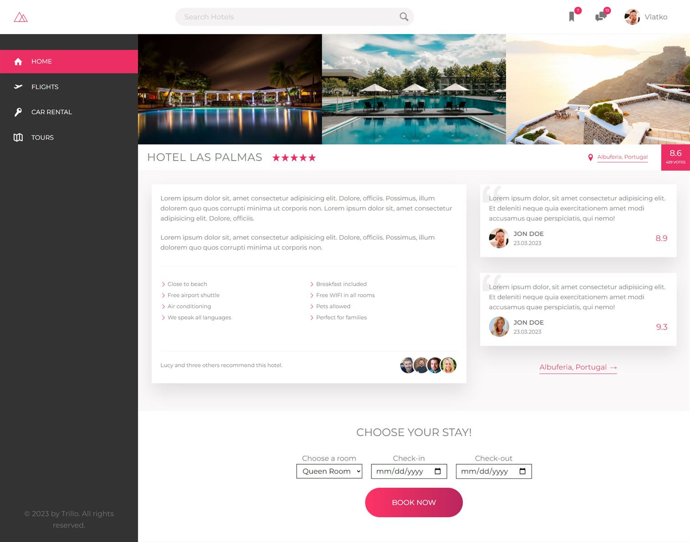

# Trillo Website

Trillo Website is one of the final projects from Advanced Css and Sass course by Jonas Schmedtmann where i show my in HTML and CSS - SASS. In this interesting demo project i had to test my skills with Flex-Box and responsive design and layouts. It was a cool project to furhtr dive deep in CSS and SASS and also using the BEM naming method for working with sass.

## Live Preview

To see live preview of the project [Click Here](https://jakimoski.github.io/Trillo/ "Trillo Website")

## Clone the repo

```
https://github.com/jakimoski/Trillo.git

```


